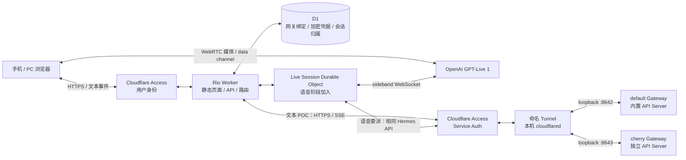
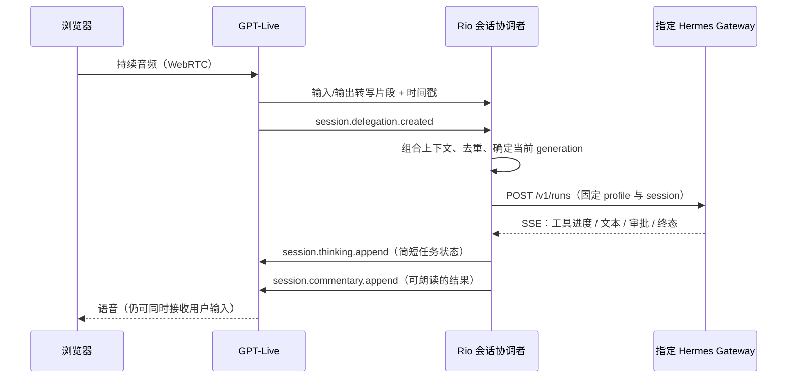

# Rio：可行性调研与架构提案

调研日期：2026-09-20。状态：**待 review；尚未实施或部署 POC**。

## 1. 结论与证据边界

**方案可行，已有官方协议和 Hermes 实现作为依据。推荐先验证 Worker → Tunnel → default Gateway 的真实文本执行，再接 GPT-Live 语音。**

当前确认的是协议、源码和本机前置条件；尚未获得部署后的网络往返、真实工具执行、移动端语音或实际延迟证据。

| 问题 | 调研结论 |
| --- | --- |
| 用户所指的新模型是否存在？ | 官方名称为 **GPT-Live 1**，模型 ID `gpt-live-1`；OpenAI changelog 记载于 **2026-09-10** 上线，距本次调研正好 10 天。应按 `/v1/live/sessions` 协议设计。[O1][O2] |
| 能否把大模型和工具执行交给 Hermes？ | 可以。使用 `delegation: { type: "client" }`，由 Rio 调用自有后端；语音层负责听、说、交互和委派时机，Hermes 负责实质任务。[O3] |
| Hermes 是否已有相同思路？ | 有。Desktop 已实现 WebRTC、客户端委派、转写上下文、Hermes 普通回合和语音结果回填。[H1–H3] |
| 能否调用正在运行的 Gateway？ | 可以启用其**内置 API Server adapter**。它运行在 `gateway run` 进程中，提供真实 agent runs、事件流、停止、steer、审批、会话历史。[H4][H5] |
| 本机是否已经可直接从 Tunnel 调用？ | 尚未。本次检查 default 与 cherry 的 Gateway 进程均存在，但两者均未监听 TCP；需要在 POC 阶段启用 API Server。 |
| 是否必须开发本机代理？ | 首选方案不需要。使用 Hermes 内置 HTTP API 和 `cloudflared` 即可。 |
| 是否能自由填写任意 OpenAI-compatible provider？ | 设置可以支持自定义 URL/key；兼容性必须涵盖 **Live session 创建、WebRTC SDP、client delegation、sideband、关闭会话**，仅支持 Chat Completions 不足以接入。 |

这里“语音层不执行工具”指本项目采用的 client delegation 模式。GPT-Live 本身还支持 Responses delegation，由 OpenAI 托管后端模型；Rio 不需要再增加这一层推理中转。[O3]

## 2. 本机与参考版本

| 对象 | 已核实状态 |
| --- | --- |
| GitHub | `https://github.com/nocoo/rio`，私有，当前目录 `main` 跟踪 `origin/main` |
| 本机 Hermes | `~/.hermes/hermes-agent`，源码版本 `0.21.1`，commit `b7ac3ba1cdf89f94dfe86de27e01358b194f4053` |
| default | `~/.hermes`；调研时 PID `998`，由 LaunchAgent `ai.hermes.gateway` 管理 |
| cherry | `~/.hermes/profiles/cherry`；调研时 PID `93848`，由 Herdr 插件管理 |
| 官方参考仓库 | `reference/hermes-agent`，从官方最新 main 独立 clone；不修改运行中的安装 |
| 参考 commit | `30de041b011aa3d3830a7ffa05815e2cb2f063be`，2026-09-19；`pyproject.toml` 为 `0.21.3` |
| 最新已发布版本 | Hermes Agent `v0.21.3`，release tag `v2026.9.14` |
| Cloudflare CLI | `cloudflared 2026.9.1`；`wrangler 4.129.1` 已登录。Tunnel/Access 管理权限与具体资源尚未验证 |

`reference/` 已加入 `.gitignore`，不会把官方源码、运行数据或凭据提交到 Rio。以上 PID 是现场快照，POC 开始时重新确认。

本机 0.21.1 源码也有 Runs API 和 capability discovery。先以实际 `/v1/capabilities` 决定可用功能；不为调研升级或重启现有服务。若实际缺少所需能力，再单独评估升级。

## 3. 推荐架构

8642/8643 是提议端口，启用前检查占用。一个机器上的 `cloudflared` 可把多个受保护 hostname 路由到多个本地端口；不要求每个 profile 安装一个 Tunnel。每个 Gateway 在 Rio 中仍是独立绑定。

### 职责与实施时机

| 组件 | 职责 | 何时加入 |
| --- | --- | --- |
| 浏览器 | 轻量对话页、Agent 选择、设置；语音阶段持有麦克风与 WebRTC 播放 | 文本 POC 起步；视觉设计见 [experience.md](experience.md) |
| Worker + Static Assets | Access 身份验证、路由授权、API 创建、SSE 转发、设置接口 | 文本 POC |
| D1 | 绑定信息、加密后的外部凭据、用户与 conversation/run 的归属；不镜像 Hermes 全部历史 | 文本 POC 保留必要映射；设置 UI 随产品补齐 |
| Live Session DO | 每次语音会话一个协调者，拥有 sideband、转写、委派去重、结果回填、超时与关闭 | 语音阶段；不阻塞文本 POC |
| Tunnel + Access Service Auth | 让 Worker 安全访问本机特定 HTTP 服务 | 文本 POC |
| Hermes | 保持所选 profile 的模型、工具、记忆与审批配置，保存 agent 会话和执行结果 | 复用现有 Gateway |

起步采用 TypeScript、轻量 React/Vite 页面和原生 Fetch/Streams/WebRTC。无需额外 agent framework、语音媒体服务器、队列或录音存储。Durable Object 仅解决真实的语音会话协调，不承担第二个大模型 agent。

### 为什么不用 Desktop 的整个服务端

Desktop 的聊天路径是 `hermes serve` → WebSocket JSON-RPC → `prompt.submit`，与当前常驻的 `hermes gateway run` 是不同服务面。照搬 `serve` 会另起一个 agent 后端，不能据此声称已验证对现有 Gateway 的调用。[H6]

Rio 复用 Desktop 的语音协议与交互方法，聊天执行入口选择 Gateway 的公开 Runs API。这样 profile 的配置和工具仍由当前 Gateway 提供。

Rio 在该 profile 下创建自己的新会话；不会自动接管或合并 Telegram、Discord 等已有对话。API Server 的工具集合按 `api_server` 平台配置解析，POC 要核实它满足目标能力，不能假定与所有消息平台完全一致。

## 4. 网关绑定与路由

用户看到的是 Agent 名称，例如“默认助手”“Cherry”；设置中才呈现机器、profile 和网络信息。

每个绑定至少包含：

| 字段 | 用途 |
| --- | --- |
| `gateway_id` | Rio 分配的稳定、不透明 ID；页面只提交此 ID |
| `name`, `machine_label`, `profile` | 展示名称与连接目标身份 |
| `base_url` | 该 Gateway 的受保护 HTTPS hostname；仅管理员可编辑 |
| Access Client ID/Secret | Worker → Tunnel hostname 的 Service Auth 凭据 |
| Hermes API key | 该 profile 的 `API_SERVER_KEY`，与 Access 凭据分开 |
| `capabilities`, `last_checked_at` | 最近探测结果；显示“已验证/未验证/不可达”及时间 |

默认用**独立端口、独立 hostname、独立密钥**对应本机现有的两个进程。后续接入另一台机器只需增加绑定。

Hermes 另有 multiplex 的 `/p/<profile>/...` 共享监听能力，并要求各 profile 自己的 key。它是可选拓扑；不为 Rio 强行合并现有两个进程，也不把任意客户端传来的 profile/path 直接拼进上游 URL。[H4]

会话路由固定为：`Access subject → Rio conversation → gateway_id → Hermes session_id`。执行映射再加入 `Rio request_id → Hermes run_id`；语音阶段加入 `Live session_id + delegation_id + generation`。每个 stop/steer/approval/status 请求重新检查归属。切换 Agent 创建新的会话归属，不在运行中把请求悄悄换到别的 Gateway。

## 5. 文本层：先证明真实执行

推荐把“向上提交”和“向下流式返回”分成 HTTP 控制请求与 SSE 事件流。它满足双向应用交互，也允许在接收回复时发送停止或追加指令，无需先发明一套 WebSocket 协议。

| 操作 | Hermes 原生入口 |
| --- | --- |
| 能力 / 就绪 | `GET /v1/capabilities`、`GET /health/detailed` |
| 独立对话 | `POST /api/sessions`；保存服务器返回的 session ID |
| 提交 | `POST /v1/runs`，传 `input`、`session_id`，带 `Idempotency-Key` |
| 流式进度 | `GET /v1/runs/{run_id}/events` |
| 状态补偿 | `GET /v1/runs/{run_id}`、`GET /api/sessions/{id}/messages` |
| 追加指令 / 停止 | `POST /v1/runs/{run_id}/steer`、`.../stop` |
| 人工审批 | `POST /v1/runs/{run_id}/approval`，使用实际待审批 request ID 和单次决定 |

上游响应以当前 `/v1/capabilities` 和返回值为准。[H4][H5]

**三个实现约束：**

1. Hermes Runs SSE 的实际负载形如 `data: {"event":"message.delta", ...}`，不要误按 OpenAI Live 的 `type` 字段解析。心跳为 SSE 注释；Worker 逐块转发，禁止读完整个 body 后才返回。[H5]
2. 当前实现使用单个 run 队列消费，未提供可依赖的 `Last-Event-ID` 重放契约；多个消费者可能竞争事件，断开还会释放 transport。每个 run 只设一个上游消费者。文本 POC 断线后通过 status/history 收敛结果；语音阶段由 DO 单独消费并向界面分发，不能让浏览器和 DO 分别订阅同一上游。[H5]
3. `Idempotency-Key` 可让相同创建请求返回同一 run；不同内容复用同一 key 会冲突。它避免重复 admission，不代表外部工具副作用天然 exactly-once。停止返回 `stopping`，必须继续确认实际终态；已执行的工具不能靠打断回滚。[H4][H5]

## 6. 语音层：借鉴 Desktop，明确服务端归属

### 建立连接

1. 用户点“开始”，浏览器获取麦克风权限，创建 `RTCPeerConnection`、`oai-events` data channel 和 SDP offer。
2. 浏览器把 offer 与 `gateway_id` 发给受保护的 Rio API。服务端验证身份、绑定归属与预算。
3. Worker/DO 用服务端保存的 provider key 调用 `POST {base_url}/live/sessions`，设置 `model: "gpt-live-1"`、`delegation: {type: "client"}`、voice、短 persona 和必要文字历史，默认 `store: false`。
4. 保存上游 session ID，以同一 provider 认证连接 `wss://.../live/sessions/{session_id}/attach`。保持麦克风 track 关闭，直到服务端协调者准备就绪，避免开场转写落在 sideband 建立之前。
5. 向浏览器返回允许的 session ID 与 SDP answer。浏览器应用 answer，等待 `session.started` 后启用输入。HTTP 已启动会话，不再发送 `session.start`。[O4][O5]

实时播放媒体在浏览器与 OpenAI 间通过 WebRTC 传送。**sideband 还会反射输入/输出音频帧**，因此不能宣称 Worker 完全不接触音频；协调者丢弃这些帧，不记录、不持久化、不再次播放，并实测其吞吐和计费。[O5]

### 一次委派

**委派事件没有任务文本。** 服务端收集 `session.input_transcript.delta` 与 `session.output_transcript.delta`，保留 `start_ms/end_ms`，结合委派的 `offset_ms` 和最近对话构造请求。片段不是完整回合，时间戳也不是可靠的句子分隔符；处理迟到片段、重复事件、“是的”、纠正日期和未说完的话是语音 POC 的核心测试。[O3]

Desktop 的 `delegationPrompt()` 合并近期转写，再把最近用户话语和 spoken context 一起交给 Hermes。Rio 复用这一思路，但 `/v1/runs` **没有 Desktop 的 `surface: voice-live` / `voice_context` 契约**：将语音风格要求保持稳定，把最近转写作为当次 `input` 的明确上下文，不每轮改写系统 `instructions` 或覆盖 Hermes 全部历史。第一版接受这段上下文进入 API 会话记录的取舍。[H2][H3][H5]

返回时：

- 使用 `session.commentary.append` 提交适合说出的结果，保留原 `delegation_id`；GPT-Live 会转述，不保证逐字朗读。
- 使用 `session.thinking.append` 发送“正在读取文件”这类简短状态。此字段可能影响后续语音，**不是保存私有推理或敏感工具输出的通道**。
- 每次 append 上限 **500 tokens**。按中英文句子分段并保守控制 token；不能直接复制 Desktop 的“约 4 字符/token”估算到中文，也不能把超长工具结果原样塞进去。
- 第一轮语音 POC 先回传已完成结果；通过后再逐句推送明确可说出的 assistant 内容，避免把工具前的推测和内部 reasoning 当成最终答案。[O3]

### 打断与任务执行是两个控制面

GPT-Live 处理同时听说和语音打断。用户插话不等于已取消 Hermes 工具。

对正在执行的任务，Rio 区分“补充信息”“取消/替换任务”“只是插话”：补充走 steer；取消走 stop 并等待终态；新委派用新 generation，旧结果不得串入新任务。第一版每个会话只允许一个 foreground run，替换须完成协调后提交。

保留 Hermes 的审批。遇到待确认动作，显示明确的单次确认卡；语音可以说明，但模糊转写如“嗯”不能自动变成永久授权。播放被打断、工具已成功、工具仍在停止和等待审批分别显示真实状态。

### 为什么语音阶段建议 DO

Desktop 在可信本地窗口中协调语音与 backend；网页需要应对刷新、多标签页、移动网络切换、晚到结果和费用上限。每次 Live 会话一个 DO 可以让这些事件有唯一处理者。浏览器仅展示和发用户操作，只有服务端能创建 Hermes run。

DO 不是永不掉线的保证。重要的 ID、归属、已处理 delegation 和任务状态必须持久化；重启后先查询上游状态，不能盲目重做任务。sideband 断开时，不假定历史事件会重放；无法证明上下文完整就结束当前 Live 会话并用已保存的文字上下文重建。

外连 WebSocket 会阻止 DO hibernation，并产生时长费用；不能把本架构描述为“连接一直开着但可免费休眠”。收到音频镜像和频繁事件也有处理成本。[C7]

## 7. 安全边界

### 两个独立 Access 应用

- **Rio 网站**：人类登录，限定所有者身份。Worker 验证 `Cf-Access-Jwt-Assertion` 的签名、issuer、audience 和有效期；用户 sub 作为归属，不信任裸 email header。覆盖静态页面和 API；关闭未保护的 `workers.dev` / preview 入口，检查资产直出行为。[C2][C8]
- **本机 Gateway hostname**：只接受 Rio 专用 service token 的 **Service Auth** policy。Worker 每次调用添加 `CF-Access-Client-Id` 和 `CF-Access-Client-Secret`，另用 `Authorization: Bearer ...` 提供 Hermes key。浏览器只调用 Rio 同源接口。[C1]

Tunnel 提供出站连接和安全传输，**不会自动替公开 hostname 做访问授权**。先建立 Access 拒绝默认访问的策略，再启用相应 Tunnel route。Hermes 只绑定 `127.0.0.1`，不开放路由器端口。一个 Gateway 的 key 不可访问另一个 Gateway。[C3]

### 设置中保存 provider URL/key

URL、model、voice、已配置状态保存在 D1；API key、Gateway key、Access secret 使用 Web Crypto AES-GCM 加密后保存，主密钥放在部署级 Worker Secret 中。保存随机 nonce、密钥版本，并把所属用户/配置 ID 作为关联数据绑定，支持后续轮换。

普通设置保存无需持有 Cloudflare 账户管理 token，也不在每次保存时重新部署 Worker。Worker Secret 是运行环境注入的绑定，不能用修改 `env` 的方式实现持久化网页设置；设置 API 只返回掩码或 `configured: true`。[C6]

管理员只能配置明确认可的 HTTPS provider origin；拒绝带 URL 凭据、任意重定向和任意请求路径的代理。浏览器不能覆盖目标 URL、认证 header 或上游 session ID。URL 保存与能力验证分离，避免把“保存成功”写成“语音可用”。

POST/WS 检查同源请求，防止跨站驱动已登录浏览器；同一账号也只操作属于当前绑定的 run。日志保留 request/run/delegation ID、状态和耗时，不记录密钥、完整转写、音频或原始工具输出。设置写操作限所有者；第一版无需额外组织/角色体系。

### Cloudflare Workers VPC 备选

当前官方也提供 Workers VPC，可通过 Tunnel 和 VPC binding 访问私有服务，避免 Gateway 的公开 hostname。但截至调研仍是 beta；VPC Service 的资源/绑定配置和 VPC Network 的更大网络访问范围需要另行评估。[C9]

本次 POC 首选标准 HTTPS + Access Service Auth，便于在设置中独立绑定多台机器和多个 Gateway。如果 review 更重视“完全没有 Gateway 公网 hostname”，可切换为 VPC 路径，Hermes 文本/语音协议不变。

## 8. 成本、边界和分层

GPT-Live **$0.05/分钟，按秒计费**；等待工具、静音和双方沉默都计入活跃会话时间。90 秒为 $0.075，10 分钟为 $0.50，20 分钟为 $1.00，另加 Hermes 与 Cloudflare 费用。[O2][O6]

创建 WebRTC 会话会先计 **15 秒初始化时长**，运行后抵扣相应时长，不是额外再加 15 秒。单次初始化对应 $0.0125；不要在刷新页面、打开设置或做连通性检测时反复创建收费会话。[O4][O6]

| 层 | 本轮 / 后续验证 | GPT-Live 费用 |
| --- | --- | --- |
| 调研 | 官方资料、源码和只读本机检查；本轮完成 | 无 Live API 调用 |
| 网络与文本 | 真正部署 Worker、命名 Tunnel、调用 default Gateway、验证工具和会话 | 不创建 Live session，语音费用为 0 |
| 委派逻辑 | 用合成转写/委派事件验证去重、迟到结果、500-token 分段等应用逻辑 | 不创建 Live session；此类测试不能证明真实模型表现 |
| 语音 | 短时真实 WebRTC、插话、Hermes 工具任务、中文纠正、正常关闭 | 建议首轮累计目标不超过 20 分钟 / $1 语音费，初始化和异常关闭单独核账 |

语音阶段配置服务端会话上限、预算和闲置关闭；累计使用 `session.usage.updated.usage.seconds`，不要把累计值求和。正常结束等待 `session.closed`，关闭失败记录“最终费用未确认”。静音按钮不等于停止计费。长任务可结束语音、保留 Hermes run，用户回来后继续。

真实体验仍须验证：手机浏览器麦克风/自动播放、Wi-Fi 与蜂窝网到 OpenAI WebRTC 的可达性、Tunnel 断线、系统休眠、中文人名/日期和工具等待时的语音行为。Cloudflare 页面可访问不代表设备到语音媒体端点也可访问。

## 9. 本次 review 的建议决策

1. 采用 Gateway **内置 API Server + 每个绑定独立身份**，首先只测试 default。
2. 采用**命名 Tunnel + 两个 Access 安全边界**，不使用 Quick Tunnel；官方明确 Quick Tunnel 不支持 SSE。[C4]
3. 先完成 [文本 POC 验收](poc-plan.md)，再加入 client delegation 和语音会话协调。
4. 采用 [沉浸式、移动端优先的交互方向](experience.md)，详细设置从日常对话页中收起。

本轮未启用 API Server、重启 Gateway、创建 Cloudflare 网络资源、调用收费语音 API 或运行真实 Hermes 任务。下一步由用户 review 本方案后进入 POC。

## 10. 资料索引

以下官方网页均于 2026-09-20 实际抓取阅读；Hermes 链接固定到调研 commit，避免 main 后续变化造成证据漂移。

### OpenAI

- [O1：API Changelog，2026-09-10 发布 GPT-Live](https://developers.openai.com/api/docs/changelog)
- [O2：GPT-Live 1 模型、计价和可用性](https://developers.openai.com/api/docs/models/gpt-live-1)
- [O3：Delegation and tools，client mode 与 500-token append](https://developers.openai.com/api/docs/guides/live-delegation)
- [O4：Live WebRTC 建连与初始化计费](https://developers.openai.com/api/docs/guides/voice-webrtc?api=live)
- [O5：sideband、镜像音频与服务端控制](https://developers.openai.com/api/docs/guides/voice-server-controls?api=live)
- [O6：GPT-Live 成本与闲置优化](https://developers.openai.com/api/docs/guides/voice-latency-cost?api=live)
- [O7：会话、转写、关闭、store 与恢复](https://developers.openai.com/api/docs/guides/live-conversations)

### Hermes

- [H1：Desktop GPT-Live 用户文档](https://github.com/NousResearch/hermes-agent/blob/30de041b011aa3d3830a7ffa05815e2cb2f063be/website/docs/user-guide/features/voice-mode.md#desktop-gpt-live-voice-chat-mode-full-duplex-delegates-to-hermes)
- [H2：voice-live.ts，浏览器媒体与 Live events](https://github.com/NousResearch/hermes-agent/blob/30de041b011aa3d3830a7ffa05815e2cb2f063be/apps/desktop/src/lib/voice-live.ts)
- [H3：Desktop 委派与回复协调 hook](https://github.com/NousResearch/hermes-agent/blob/30de041b011aa3d3830a7ffa05815e2cb2f063be/apps/desktop/src/app/chat/composer/hooks/use-voice-live-conversation.ts)
- [H4：API Server 官方文档](https://github.com/NousResearch/hermes-agent/blob/30de041b011aa3d3830a7ffa05815e2cb2f063be/website/docs/user-guide/features/api-server.md)
- [H5：Runs admission、SSE、审批和停止实现](https://github.com/NousResearch/hermes-agent/blob/30de041b011aa3d3830a7ffa05815e2cb2f063be/gateway/platforms/api_server_runs.py)
- [H6：Desktop 的 serve / Gateway 进程边界](https://github.com/NousResearch/hermes-agent/blob/30de041b011aa3d3830a7ffa05815e2cb2f063be/apps/desktop/src/AGENTS.md)
- [H7：Live session 创建、provider URL 和凭据解析](https://github.com/NousResearch/hermes-agent/blob/30de041b011aa3d3830a7ffa05815e2cb2f063be/tools/voice_live.py)
- [H8：HTTP API 身份验证、能力与会话接口](https://github.com/NousResearch/hermes-agent/blob/30de041b011aa3d3830a7ffa05815e2cb2f063be/gateway/platforms/api_server.py)

### Cloudflare

- [C1：Access service tokens 与 Service Auth](https://developers.cloudflare.com/cloudflare-one/access-controls/service-credentials/service-tokens/)
- [C2：Access JWT 验证](https://developers.cloudflare.com/cloudflare-one/access-controls/applications/http-apps/authorization-cookie/validating-json/)
- [C3：Tunnel 架构](https://developers.cloudflare.com/cloudflare-one/networks/connectors/cloudflare-tunnel/) / [创建命名 Tunnel 和路由](https://developers.cloudflare.com/cloudflare-one/networks/connectors/cloudflare-tunnel/get-started/create-remote-tunnel/)
- [C4：Quick Tunnel 限制，包括不支持 SSE](https://developers.cloudflare.com/cloudflare-one/networks/connectors/cloudflare-tunnel/do-more-with-tunnels/trycloudflare/)
- [C5：Worker Streams](https://developers.cloudflare.com/workers/runtime-apis/streams/) / [WebSockets](https://developers.cloudflare.com/workers/runtime-apis/websockets/)
- [C6：Worker Secrets](https://developers.cloudflare.com/workers/configuration/secrets/)
- [C7：DO 生命周期和外连限制](https://developers.cloudflare.com/durable-objects/concepts/durable-object-lifecycle/) / [计费](https://developers.cloudflare.com/durable-objects/platform/pricing/)
- [C8：静态资产与 Worker-first 路由](https://developers.cloudflare.com/workers/static-assets/routing/worker-script/) / [workers.dev 入口](https://developers.cloudflare.com/workers/configuration/routing/workers-dev/)
- [C9：Workers VPC，当前 beta](https://developers.cloudflare.com/workers-vpc/)
- [C10：cloudflared run 参数与 token-file](https://developers.cloudflare.com/cloudflare-one/networks/connectors/cloudflare-tunnel/configure-tunnels/cloudflared-parameters/run-parameters/)
